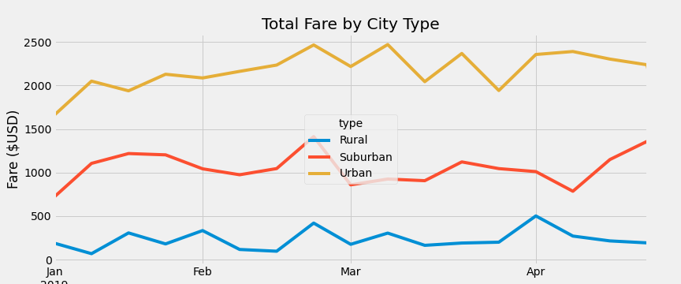

# PyBer_Analysis

Overview of the analysis: Explain the purpose of the new analysis.
Results: Using images from the summary DataFrame and multiple-line chart, describe the differences in ride-sharing data among the different city types.
- There is a description of the differences in ride-sharing data among the different city types. Ride-sharing data include the total rides, total drivers, total fares, average fare per ride and driver, and total fare by city type. (7 pt)

Summary: Based on the results, provide three business recommendations to the CEO for addressing any disparities among the city types.
- There is a statement summarizing three business recommendations to the CEO for addressing any disparities among the city types. (4 pt)

## Results

