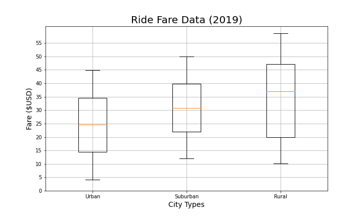

# PyBer_Analysis

## Overview
Data analysis will be performed on raw data provided by 'PyBer', a ride-sharing company. The has been provided in 2 csv's: 1 containing information about the ride, and the 2nd containing information about cities PyBer is active in. The analysis will focus mainly on the differentiating between different 'City Types' (i.e. Rural, Urban, and Suburban).

## Results
### Total fare by City Type
- 

- There is a description of the differences in ride-sharing data among the different city types. Ride-sharing data include the 
### total rides
- 
- 
- 
### total drivers
- 
- 
### total fares
- 
- By City Type:
  - 
- average fare per ride and driver, and 
- total fare by city type.

# Summary
Based on the results, provide three business recommendations to the CEO for addressing any disparities among the city types.
- There is a statement summarizing three business recommendations to the CEO for addressing any disparities among the city types. (4 pt)
